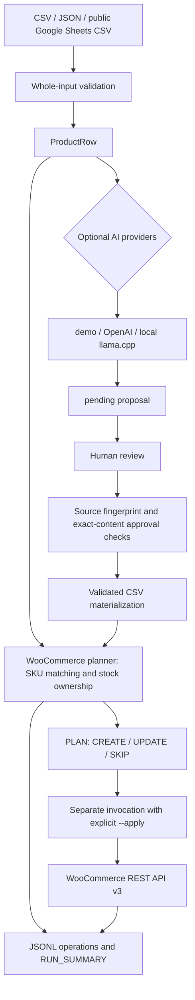
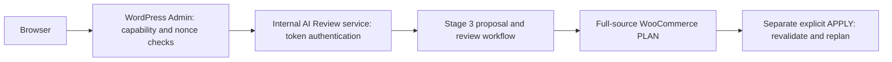

# WooCommerce Product Automation Lab

## Overview

A personal engineering lab connecting a real local **WooCommerce storefront** with a validated product pipeline and reviewed AI content. **Biurko / Lab** is a fictional Polish desk-accessory shop: six products, three categories, PLN, an original theme, cart and offline checkout.

The project demonstrates how catalog updates can preserve store-owned inventory, avoid unnecessary writes and keep generated copy behind an explicit review boundary. It is not a client project or a production deployment.

## Key features

- **CSV / JSON / public Google Sheets CSV** adapters share validation and `ProductRow` normalization.
- **SKU matching**, CREATE / UPDATE / SKIP, changed-field-only updates and an idempotent second run.
- **PLAN by default**, explicit `--apply`, source-owned or WooCommerce-owned stock, JSONL operation and run reports.
- **Human-in-the-loop AI** with offline `demo`, local `llama.cpp` and optional OpenAI Responses providers; pending proposals, content-bound approval and stale-source protection.
- **141 offline regression tests**; recorded real WooCommerce, checkout, Sheets and local-model acceptance results.

## Architecture



The AI path produces a local file, not an API write. APPLY recomputes the plan; a previous PLAN is a preview, not a frozen transaction. See [architecture](docs/architecture.md).

## Safety / design decisions

- Validate every input row and preflight the complete plan before writes. Errors during APPLY can still leave earlier successful writes in place: the API is not transactional.
- Retry transient **GET** failures only; never automatically retry POST / PUT. SKIP sends no write request.
- `--stock-authority woocommerce` protects existing inventory after checkout. The default `source` policy treats source stock as authoritative; new products always use source initial stock.
- Local HTTP uses signed **OAuth 1.0a** on loopback. Public endpoints require HTTPS; Basic Auth is used only over verified TLS. Redirects are blocked.
- AI can change only `description`, `short_description` and `image_alt`. Approval binds the exact text and source fingerprint. Atomic file publication avoids partial proposals/CSV files.
- Credentials, `.env`, logs, proposals and backups stay outside Git. Reports can contain catalog content: review them before sharing.

## Quick start

Requirements: **Python 3.10+** with pip and venv. Docker is needed only for the local store; tests and demo proposals need no services or keys. From the repository root, in Windows PowerShell:

```powershell
py -3 -m venv .venv
& .\.venv\Scripts\python.exe -m pip install -e .
& .\.venv\Scripts\python.exe scripts/run-tests.py
& .\.venv\Scripts\woo-sync.exe validate data/catalog.json
```

On Linux/macOS: `python3 -m venv .venv`, then `.venv/bin/python -m pip install -e .`; use `.venv/bin/python` and `.venv/bin/woo-sync` thereafter. No third-party runtime packages are required. Pillow is optional and needed only to redraw the supplied original illustrations.

For a **fresh store**, follow [Windows setup](docs/WINDOWS.md): create local database secrets, start Compose, install WordPress/WooCommerce, deploy the demo and generate a local API key. A fresh clone has no database or installed plugins. Existing installations keep their volumes and `.env`.

Once configured, activate the venv (or use the full executable paths above):

```powershell
woo-sync sync data/catalog.json --stock-authority woocommerce
# After reviewing the plan, an explicit write invocation:
woo-sync sync data/catalog.json --stock-authority woocommerce --apply
```

Credentials come from ignored `.secrets/woocommerce.json` or `WC_URL`, `WC_CONSUMER_KEY`, `WC_CONSUMER_SECRET`. Python does not automatically load Compose's `.env`. Media IDs are database-specific; regenerate the local manifest when setting up another store.

## AI workflow

This example uses only checked-in inputs and the offline provider:

```powershell
woo-ai propose data/catalog.json --provider demo --out tmp/proposal.json
# Read the file and compare every claim with the source before approving:
woo-ai approve tmp/proposal.json BL-KEY-01
woo-ai apply-proposal data/catalog.json tmp/proposal.json --out tmp/reviewed.csv
woo-sync validate tmp/reviewed.csv
# Requires a configured store; reads only:
woo-sync sync tmp/reviewed.csv --stock-authority woocommerce
```

Only approved entries change; other catalog rows keep their source content. Use a new output filename for each proposal/materialization. apply-proposal does not write to WooCommerce.
For real local inference, select --provider llamacpp; configure LLAMACPP_BASE_URL (default http://127.0.0.1:8080) and LLAMACPP_MODEL (default local alias jarvis-qwen35-9b). The verified local setup used this custom model alias through a llama.cpp-compatible server with text-only requests. Bring your own compatible model and server; neither is shipped with the repository. Local transport rejects non-loopback endpoints, redirects and system proxies.

## WordPress AI Content Review UI — Stage 4

Manage product content from **WooCommerce → AI Content Review**. The MU-plugin is a GUI and server-side proxy; existing Python Stage 3 modules remain the source of proposal, review and synchronization rules.



The review API has no host port. Secrets stay server-side. Docker-only transport exceptions are explicit: Woo HTTP allowlists only `wordpress`; `LLAMACPP_ALLOW_DOCKER_HOST=1` adds only `host.docker.internal`, without changing default CLI trust. No model is bundled or inferred from its alias.

**Stage 4 is verified end-to-end locally.** A real local llama.cpp proposal was generated in wp-admin, manually reviewed and approved, previewed through WooCommerce PLAN, applied with an explicit write, and followed by a second PLAN confirming idempotence. The verified sequence was Generate → Review → PLAN → APPLY → repeat PLAN. See [Stage 4 setup, verification and limitations](docs/stage4-wp-admin-ai-review.md) and [Windows startup](docs/WINDOWS.md#stage-4--wp-admin-ai-content-review).

## Tests

```powershell
python scripts/run-tests.py
git diff --check
```

The runner discovers the full suite and blocks socket networking. All **141 tests** run without WooCommerce, llama.cpp, OpenAI or credentials. [GitHub Actions](.github/workflows/tests.yml) runs the same suite on push and pull requests, using Python 3.10 and 3.13 on Ubuntu and Windows. Installing Python/build tools may require network access; the regression suite does not.

Live acceptance scripts in `scripts/verify-*.py` are separate, stateful historical scenarios that can write to a configured store. They are not part of CI and should not be run against unrelated data.

## Verified results

| Recorded scenario | Result | Evidence |
|---|---|---|
| WooCommerce price/stock update and invalid input/auth | Only price/stock updated; invalid CSV and HTTP 401 preserved six products | [API results](docs/api-test-results.json) |
| Guest checkout, offline payment | 179.00 + 12.90 = 191.90 PLN; no payment or email delivery | [Checkout](docs/checkout-test-results.json) |
| Public Sheets → WooCommerce PLAN | CREATE 0 / UPDATE 0 / SKIP 6 / ERROR 0; GET 7 / POST 0 / PUT 0 | [Sheets results](docs/google-sheets-integration-results.json) |
| Real local llama.cpp → reviewed CSV → PLAN | CREATE 0 / UPDATE 1 / SKIP 5 / ERROR 0; GET 7 / POST 0 / PUT 0 | [Local AI results](docs/stage3-local-ai-results.json) |
| Stage 4 wp-admin AI review → PLAN → APPLY → repeat PLAN | PLAN: CREATE 0 / UPDATE 1 / SKIP 5 / ERROR 0; APPLY: UPDATE 1 / PUT 1; repeat PLAN: CREATE 0 / UPDATE 0 / SKIP 6 / ERROR 0 | [Stage 4 verification](docs/stage4-wp-admin-ai-review.md) |

The local AI test planned two description changes and confirmed unchanged store data. Review was performed by Codex under the owner's delegated acceptance-test instruction, **not an independent human sign-off**. Recorded older test counts describe earlier stages; the Stage 3 regression baseline was 89; Stage 4 currently has 141 offline tests. These are functional acceptance results, not throughput benchmarks.

## Project stages

1. **v1.0.0 — Store and synchronizer:** Docker, theme, fictional catalog, offline checkout and REST synchronization.
2. **v1.1.0 — Data pipeline:** canonical JSON, adapters, stock ownership and run reporting.
3. **v1.2.0 — Reviewed AI content:** provider abstraction, local structured output, review integrity and materialization.

4. **v1.3.0 — WordPress AI Content Review UI (verified locally end-to-end):** internal Python service and wp-admin Generate → Review → PLAN → explicit APPLY, followed by a repeat PLAN confirming no remaining changes. Package version is `1.3.0`; the release tag is created only during the publication step.

## Documentation

- [Windows setup](docs/WINDOWS.md) and [demo data / artwork](data/README.md)
- [Architecture](docs/architecture.md) and [Stage 2 pipeline](docs/stage2-data-pipeline.md)
- [Stage 4 admin UI](docs/stage4-wp-admin-ai-review.md)
- [Stage 3 workflow](docs/stage3-ai-content.md) and [historical demo-provider results](docs/stage3-ai-workflow-results.json)
- [llama.cpp security review](docs/llamacpp-security-review.md)
- [Portfolio case study](docs/portfolio-case-study.md)

## Limitations

Simple products only; no variations or sale-price workflow. Categories must already exist. There is no cross-product rollback, scheduling service, production deployment or authenticated multi-user review system. Source-owned fields can overwrite store differences; stock protection is not a content-only update mode.

Model schema validation does not establish factual truth. ALT proposals use source text, not image understanding. Local integrity hashes cannot defend against a malicious owner who can rewrite both files and hashes. CSV export rejects mixed optional-field presence when it cannot preserve semantics.

The historical shared llama.cpp server exposed its port on all interfaces; [remediation is documented](docs/llamacpp-security-review.md), but its configuration was not changed. Public repository readiness is separate from server/deployment security. The storefront and checkout remain local demonstrations with fictional data.
