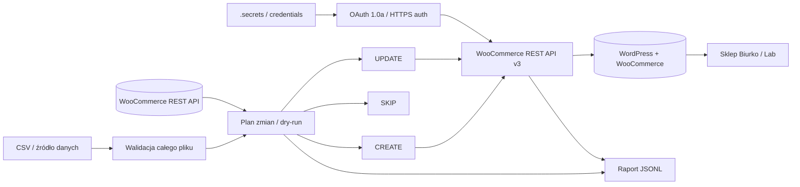

# Architektura WooCommerce Product Automation Lab

## Zasady synchronizacji

- SKU jest kluczem identyfikującym produkt.
- Cały CSV jest walidowany przed pierwszym zapisem.
- Domyślny tryb synchronizacji wykonuje dry-run.
- CREATE tworzy brakujący produkt.
- UPDATE wysyła tylko pola, które faktycznie się zmieniły.
- SKIP oznacza brak wymaganych zmian.
- Operacje są raportowane do JSONL.
- Sekrety API nie są przechowywane w repozytorium.

## Lokalne środowisko demonstracyjne

WordPress i MariaDB działają przez Docker Compose.

Lokalny sklep: http://localhost:8090

Dla HTTP na loopback synchronizator wykorzystuje podpis OAuth 1.0a. Publiczne wdrożenie powinno używać HTTPS.

## Checkout demonstracyjny

- 179,00 zł + 12,90 zł dostawy = 191,90 zł.
- Darmowa dostawa działa od 250,00 zł.
- Płatna metoda jest ukrywana, gdy dostępna jest darmowa.
- Zamówienie testowe powstaje przez standardowy checkout WooCommerce.
- Wysyłka e-mail jest wyłączona.
- Rzeczywiste płatności nie są wykonywane.
