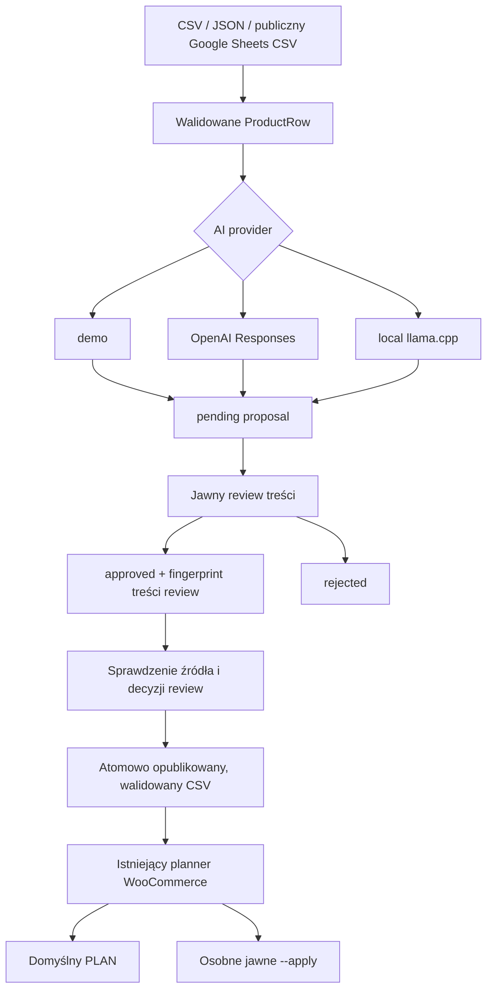

# Stage 3 — lokalne AI i ręcznie zatwierdzane treści

Stage 3 dodaje propozycje treści do działającego pipeline Stage 2. Nie zapisuje automatycznie do WooCommerce. Domyślnym providerem CLI pozostaje offline `demo`; prawdziwy lokalny backend wybiera się przez `--provider llamacpp`. OpenAI jest opcjonalny i nie jest wymagany do testów ani demonstracji.



## Konfiguracja lokalnego providera

| Ustawienie | Domyślnie |
|---|---|
| `LLAMACPP_BASE_URL` | `http://127.0.0.1:8080` |
| `LLAMACPP_MODEL` | `jarvis-qwen35-9b` |
| Endpoint | `/v1/chat/completions` |
| Wyjście | `response_format.type=json_schema`, trzy pola treści |
| Timeout | 180 s na operację sieciową; uwzględnia ładowanie modelu on-demand |
| Limit odpowiedzi | 256 KiB |
| Klucz API | Niewymagany dla obecnego backendu |

Dozwolone hosty: dokładnie `127.0.0.1`, `localhost`, `::1`; HTTP i HTTPS. Base URL musi wskazywać korzeń serwera: bez `/v1`, loginu, query, fragmentu i znaków sterujących. Port jest sprawdzany. `localhost` zostaje przypięty do numerycznego loopback. Systemowe proxy są wyłączone dla lokalnego providera, przekierowania odrzucane. HTTPS zachowuje standardową weryfikację certyfikatu; nie ma opcji `verify=false`.

Żądanie jest jawnie kodowane UTF-8 (`ensure_ascii=False`, `.encode('utf-8')`). Nie ma narzędzi, streamingu ani automatycznych ponowień inference. Wynik wymaga jednego zakończonego wyboru `finish_reason=stop`, roli assistant, braku refusal/tool_calls, poprawnego obiektu JSON i dokładnie dozwolonych pól. Limit długości i zakaz HTML obowiązują także po odebraniu JSON Schema.

Uwaga: alias `jarvis-qwen35-9b` nie opisuje faktycznych wag. Zweryfikowany preset używa **Qwen3VL-8B-Instruct-Q4_K_M.gguf** i odpowiadającego mmproj. Ten pipeline wysyła wyłącznie tekst — nie uruchamia analizy zdjęcia. ALT musi wynikać z istniejącego źródłowego ALT.

## Historyczne środowisko Windows: embedded Python

Dla nowej instalacji użyj [standardowego Pythona i venv](WINDOWS.md). Poniższe polecenia zachowują zweryfikowane środowisko historycznego testu i nie są zależnością projektu.

Użyty wtedy embedded Python nie widzi automatycznie repozytoryjnego `src/`. Nie zmieniaj `python*._pth`, nie instaluj niczego do embedded runtime. W PowerShell, w katalogu repozytorium:

```powershell
$py = 'C:\AI\ComfyUI_windows_portable\python_embeded\python.exe'
function woo-ai { & $py -X utf8 -c "import sys; sys.path.insert(0,'src'); from woo_sync.ai_cli import main; raise SystemExit(main())" @args }
function woo-sync { & $py -X utf8 -c "import sys; sys.path.insert(0,'src'); from woo_sync.cli import main; raise SystemExit(main())" @args }

& $py -X utf8 scripts/run-tests.py
```

W standardowym środowisku Pythona z instalacją `pip install -e .` oba polecenia są entry pointami z `pyproject.toml`.

Do jednego inference utwórz źródło zawierające wyłącznie `BL-KEY-01`. W wykonanym teście użyto `tmp/stage3-local/source.json`, z manifestem `data/media.local.json`:

```powershell
woo-ai propose tmp/stage3-local/source.json --media data/media.local.json --provider llamacpp --out tmp/review-new.json
# Odczytaj proposal; porównaj KAŻDE twierdzenie ze źródłem.
woo-ai approve tmp/review-new.json BL-KEY-01
# Alternatywa po negatywnym review: woo-ai reject tmp/review-new.json BL-KEY-01
woo-ai apply-proposal data/catalog.json tmp/review-new.json --out tmp/content-reviewed.csv
woo-sync validate tmp/content-reviewed.csv
woo-sync sync tmp/content-reviewed.csv --stock-authority woocommerce --log logs/content-reviewed-plan.jsonl
```

`apply-proposal` zapisuje tylko lokalny CSV. **Nie jest to WooCommerce APPLY**. W teście akceptacyjnym nie użyto `woo-sync --apply`. Plan trzeba sprawdzić także pod kątem istniejących rozbieżności między katalogiem a sklepem: materializacja zachowuje master data źródła, a zwykły synchronizator może planować ich zmianę, jeśli źródło i sklep już się różnią. `--stock-authority woocommerce` chroni stan istniejących produktów; nie jest ogólnym trybem „tylko treść”.

## Granice review i integralność

AI może proponować wyłącznie `description`, `short_description`, `image_alt`. Nie ma dostępu do credentials WooCommerce. Provider dostaje kopię ProductRow: nie może przez modyfikację mutowalnego `extra` zmienić źródła. Nieznane pola, HTML, błędne typy i przekroczone limity są odrzucane.

Nowa propozycja zawsze ma `pending`. `approve` zapisuje czas, decyzję i hash obejmujący proposal_id, SKU, fingerprint źródła i dokładną proponowaną treść. Zmiana treści po review lub ręczne ustawienie samego `approval=approved` nie wystarczy do materializacji. Decyzje CLI są serializowane blokadą systemową, a plik jest zastępowany atomowo.

Fingerprint źródła obejmuje także obecność pól opcjonalnych: brak pola i obecna pusta wartość oznaczają co innego. Zmiana ceny, stanu, identyfikatora obrazu albo zakresu zarządzanych pól unieważnia starą propozycję. Starsze propozycje z wcześniejszej wersji Stage 3 należy wygenerować i przejrzeć ponownie; nie migrujemy automatycznie zatwierdzeń. Stary plik dowodowy `stage3-ai-workflow-results.json` pozostaje historycznym zapisem poprzedniego testu.

To lokalna granica workflow, nie system tożsamości ani podpis cyfrowy człowieka. Właściciel z prawem zapisu do repo może zmienić kod/JSON i przeliczyć hash. Potrzebne jest zaufanie do lokalnych plików. W wykonanym E2E przegląd i polecenie approve wykonał Codex na wyraźne zlecenie użytkownika; dowód nie udaje osobnej akceptacji człowieka.

## Materializacja i pliki

Nowy JSON i CSV najpierw powstają w unikalnym pliku tymczasowym, są flushowane/fsyncowane, a dopiero potem atomowo publikowane bez nadpisania istniejącego pliku (hard link NTFS). Decyzja review używa atomic replace. Awaria przed publikacją nie zostawia częściowego pliku docelowego.

CSV przed publikacją przechodzi ten sam `load_csv` co zwykły synchronizator i kontrolę wiernego odtworzenia ProductRow. Niepoprawny ALT przy obrazie, niepoprawne master data albo normalizacja zmieniająca zatwierdzoną treść zatrzymują zapis. Źródła z różnymi zestawami pól opcjonalnych w różnych wierszach są odrzucane przy eksporcie do jednego CSV: format prostokątny nie zachowa różnicy między nieobecnością a pustą komórką. Należy podzielić je według zarządzanych pól; nie dopisujemy pustych wartości po cichu.

## Grounding i ograniczenia

Prompt pozwala wyłącznie przeformułować jawne fakty. Zabrania dopisywania kompatybilności, systemów operacyjnych, certyfikatów, parametrów, grup odbiorców, zastosowań i marketingowych twierdzeń o jakości. Instrukcje wewnątrz danych produktu nie są poleceniami dla modelu. Informacja o fikcyjności produktu musi pozostać.

JSON Schema zapewnia strukturę, **nie prawdziwość**. Prompt ogranicza ryzyko, ale nie dowodzi odporności na każdą halucynację lub prompt injection. Review pozostaje wymagany. Test rzeczywisty dotyczy jednego SKU, a nie jakości wszystkich przyszłych generacji.

OpenAI pozostaje opcjonalny, testowany z mockiem. Nie wykonano płatnego wywołania ani nie zmieniano modelu OpenAI. Obsługa błędnych struktur i odmów została zaostrzona zgodnie z [Structured Outputs](https://developers.openai.com/api/docs/guides/structured-outputs). Błędy transportu nie zawierają odpowiedzi serwera ani sekretów.

## Dowód akceptacyjny

`docs/stage3-local-ai-results.json` zawiera wynik prawdziwego modelu, porównanie faktów ze źródłem, decyzję review, zabezpieczenia i RUN_SUMMARY WooCommerce. Raport: `logs/stage3-local-plan.jsonl` (lokalny, ignorowany). Artefakty review/materializacji: `tmp/stage3-local/` (ignorowane).

Wynik: 6 produktów w materializacji, tylko BL-KEY-01 zmienia dwa opisy; ALT, nazwa, cena, stan i status pozostają nienaruszone. **CREATE 0 / UPDATE 1 / SKIP 5 / ERROR 0; GET 7 / POST 0 / PUT 0.**
