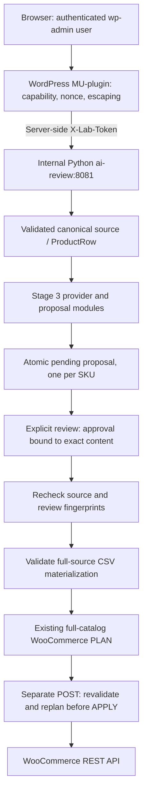

# Stage 4 / v1.3.0 — WooCommerce AI Content Review UI

Status: **implemented, covered by offline tests and verified locally end-to-end**. The acceptance run used the real wp-admin workflow with a local llama.cpp-compatible provider: Generate → manual Review/Approve → WooCommerce PLAN → explicit APPLY → repeat PLAN. The final repeat PLAN confirmed that the store already matched the approved result.

## Purpose and architecture

Manage the existing Stage 3 workflow from WooCommerce → **AI Content Review**, without running each CLI command manually.



PHP is a GUI and server-side proxy, not a second proposal/synchronization engine. Python delegates to `load_source`, `get_provider`, `build_proposal`, `review_proposal` (which calls `set_approval`), `apply_approved`, `write_materialized_csv`, `load_csv`, `WooClient` and `sync`. The service uses the standard library only; importing it does not require credentials.

## Workflow and scope

1. Select a product, open its review, choose a provider (default **Local llama.cpp**) and Generate.
2. Compare current source text with proposed description, short description and image ALT. Verify every claim. Approve or reject explicitly.
3. Approved proposals allow **Preview WooCommerce PLAN**. This reads the store and plans the **entire canonical catalog**, retaining the original preflight behavior.
4. Only a successful, recent PLAN for this user/proposal reveals **Apply approved changes**. APPLY is a separate POST with its own nonce. The backend repeats validation, approval integrity, source fingerprint checks and full preflight; a prior plan is not write authorization or a frozen transaction.

AI cannot modify name, price, stock or status. The **LOCKED** labels describe the AI boundary. The full-source synchronizer can still reconcile unrelated source-owned field differences or create missing products. Expand all planned values before APPLY. `stock_authority=woocommerce` preserves existing store quantities, but new products use source initial stock. There is no transaction across products; a failed APPLY may follow successful earlier writes. Do not blindly retry after a timeout or partial failure: inspect the report and run PLAN again.

Regeneration atomically replaces the active proposal and resets it to pending. Browser forms include the proposal ID, so a stale tab cannot approve/apply a newer generated proposal. Approval remains bound to exact content by Stage 3 fingerprints. Source or approved-text edits invalidate later PLAN/APPLY. Review itself does not generate a plan or write to WooCommerce.

## Internal HTTP contract

All endpoints except `GET /health` require `X-Lab-Token` and constant-time comparison. Startup fails for a missing/blank token. Health exposes only service name and status.

| Method | Path | Input / result |
|---|---|---|
| GET | `/health` | Minimal status; no auth or environment details |
| GET | `/products` | Validated SKU/name and three content fields only |
| GET | `/proposal?sku=...` | Current/proposed content, status, proposal ID, creation/review times |
| POST | `/propose` | `sku`, `provider`: demo / llamacpp / openai; generates one product |
| POST | `/review` | `sku`, `decision`: approved / rejected |
| POST | `/plan` | `sku`; approved proposal required; full-source read-only plan |
| POST | `/apply` | `sku`; approved proposal required; explicit full-source write |

Review/PLAN/APPLY also accept `proposal_id` as a stale-tab precondition; the WordPress UI always sends it. JSON bodies must be objects with supported fields, a valid content length and `application/json`. Duplicate JSON keys, non-finite numbers, chunked bodies, malformed SKU, extra fields and bodies over 64 KiB are rejected. SKU validation reuses the project's shared contract and matches source products case-insensitively.

Responses use 200/400/401/404/405/409/413/415/502/503. Failure messages are fixed and contain no exception repr, traceback, raw backend body or secret file contents. Sync failures can return a sanitized partial operation report with HTTP 502 and ERROR counts. No CORS access is advertised. Connections close after each response, socket reads have timeouts, and the server caps active request threads at 16. This is an internal demo API, not an Internet-facing server.

## Threat model and security decisions

| Boundary | Control and remaining assumption |
|---|---|
| Browser → WordPress | `manage_woocommerce` checked on page/proxy/action; POST-only allowlisted actions; WordPress nonces; separate APPLY nonce; post/redirect/get avoids refresh resubmission |
| XSS | Text and attributes escaped; AI output never rendered as HTML; only local CSS/JS; response shapes validated before display |
| WordPress → Python | Fixed `http://ai-review:8081` destination, token only in server-side header, redirects disabled, bounded responses, 200 s Generate timeout and 120 s PLAN/APPLY timeout |
| Service exposure | No host `ports` for ai-review; Docker network access plus token auth. Other containers on the network still require the token |
| Woo HTTP | Explicit `allowed_http_hosts=('wordpress',)` only in the service. Default CLI still rejects non-loopback HTTP. URL userinfo/query/fragment/control characters and invalid ports are rejected. HTTP uses OAuth, never Basic Auth; HTTPS retains certificate verification |
| llama transport | Exact `LLAMACPP_ALLOW_DOCKER_HOST=1` adds only `host.docker.internal`. No suffix wildcard. Existing loopback restrictions, disabled proxies, blocked redirects, bounded output, timeout and JSON validation remain |
| Secret isolation | Read-only credential bind mount, token from ignored `.env`, no secrets in image/build context or browser. Response redaction is defense in depth; catalog files should never contain secrets |
| Paths and state | Proposal filenames are SHA-256 of validated casefolded SKU; clients cannot choose filesystem paths or backend URLs |
| Concurrency | OS-backed per-SKU operation locks serialize service Generate/review/read/PLAN/APPLY; existing review helper keeps its own decision lock. One full-source Woo sync lock prevents concurrent catalog writes; other-SKU generation remains independent. Busy operations fail safely with 409 |
| Integrity | Existing Stage 3 schema/fingerprints, atomic replacement and lossless CSV validation. Local files and their owner remain trusted; hashes are not authenticated human signatures |

The service's state files must not be modified concurrently through an external CLI/editor. The host, WordPress administrators, Docker daemon and private filesystem are trusted. Container-to-container HTTP does not provide encryption against a compromised Docker host/network. The shared llama.cpp configuration is unchanged; its host exposure is a separate environment issue. There is no browser → llama.cpp request and no browser access to Woo keys, OpenAI key, review token, provider URL or private file paths.

## Configuration

| Setting | Compose default |
|---|---|
| `AI_REVIEW_TOKEN` | Supplied privately through `.env`; same value in WordPress and Python |
| `AI_REVIEW_SERVICE_URL` | `http://ai-review:8081` (WordPress only) |
| `AI_REVIEW_SOURCE` | `/app/data/catalog.json` |
| `AI_REVIEW_MEDIA` | `/app/data/media.local.json` |
| `AI_REVIEW_CREDENTIALS` | `/run/secrets/woocommerce.json` (read-only mount) |
| `AI_REVIEW_WC_URL` | `http://wordpress`, overriding the credential file's host-local URL |
| `AI_REVIEW_STOCK_AUTHORITY` | `woocommerce`; any other value refuses startup |
| `LLAMACPP_BASE_URL` | `http://host.docker.internal:8080` |
| `LLAMACPP_ALLOW_DOCKER_HOST` | `1` only in the review container |
| `LLAMACPP_MODEL` | `jarvis-qwen35-9b`, an operator-owned local alias, not a bundled checkpoint |
| `OPENAI_API_KEY` | Optional local setting passed only to the Python service; not required for demo/local tests |

The source adapter handles missing media as before: catalogs without assets need no manifest; referenced assets require a valid manifest. No IDs are guessed. `./data` is read-only. `ai_review_data` persists proposals, validated materializations and unique JSONL reports. No previous run log is overwritten. State/log retention is currently manual; do not delete volumes to reset the UI.

The image uses Python 3.13 slim, a non-root user, a read-only filesystem and dropped capabilities. Only Python source and the thin launcher are copied; `.dockerignore` excludes local artifacts and bytecode. No framework or new runtime dependency was added. The existing PHP deployment script now copies directory **contents**, avoiding nested directories on repeated deploys.

## Start on Windows

In PowerShell, from the repository root, with Python 3.10+ and the existing local WooCommerce credential file:

```powershell
py -3 scripts/init-review-token.py
docker compose config --quiet
docker compose build ai-review
docker compose up -d
.\scripts\deploy-local.ps1
docker compose exec -T wordpress php -l /var/www/html/wp-content/mu-plugins/ai-content-review.php
```

The helper uses `secrets.token_hex(32)`, atomically updates only a missing/placeholder `AI_REVIEW_TOKEN` in ignored `.env`, preserves other values and never prints the token. An existing configured token is preserved. Do not print full `docker compose config` output: it contains resolved secrets; `--quiet` validates without exposing them. Changing `.env` requires `docker compose up -d` to recreate affected services. For a fresh clone, follow [Windows setup](WINDOWS.md) before starting ai-review; an absent credential file is deliberately not auto-created as a directory.

Open `http://localhost:8090/wp-admin/admin.php?page=lab-ai-review` using an account with `manage_woocommerce`. Select **BL-KEY-01**, keep **Local llama.cpp**, and choose **Generate AI Proposal** only when ready for the first real model test. Then review → approve → preview PLAN. **Stop there for the first acceptance review; do not APPLY yet.** The repository supplies neither llama.cpp nor a model; the operator must provide a compatible running local server and correct alias. No specific checkpoint is inferred from that alias.

## Verification and acceptance results

- Baseline: 89 offline tests. Implementation: **141 tests PASS** on Windows/Python 3.12 and Linux/Python 3.13. The Linux run used `--network none` with only source/tests/scripts mounted; no service credentials.
- New tests cover transport allowlists, token/startup rules, HTTP parsing/body limits, SKU/path safety, per-product proposals, atomic replacement/failure, stale-tab IDs, review fingerprints, pending/rejected/stale/tampered proposals, full-source preflight, stock ownership, read-only PLAN, explicit APPLY/idempotence against fakes, response redaction and concurrent operations.
- `docker compose config --quiet`, image build/start and `php -l`: PASS. Read-only health 200, unauthenticated/wrong-token products 401 and authenticated product count 6 were verified.
- Actual wp-admin empty-state page loaded; 1500 px desktop and 390 px mobile layout checked. Capability and invalid-nonce rejection were exercised for all actions without backend mutations. In-memory PHP fixtures also passed for pending, approved, rejected, unavailable, successful/failed PLAN and malformed-response states, including XSS escaping; they are rendering tests, not live workflow evidence. No real inference, OpenAI request or Woo write was performed.
- GitHub Actions remains Windows/Linux × Python 3.10/3.13 with the same offline discovery runner. Hosted CI for these uncommitted changes has not run.

Recorded local Stage 4 acceptance:

- A real proposal for `BL-KEY-01` was generated through the configured local llama.cpp-compatible provider and manually reviewed in wp-admin.
- The approved proposal changed only `description` and `short_description`; protected master fields and image ALT remained unchanged.
- Initial PLAN: `CREATE 0 / UPDATE 1 / SKIP 5 / ERROR 0`; requests `GET 7 / POST 0 / PUT 0`.
- APPLY: `CREATE 0 / UPDATE 1 / SKIP 5 / ERROR 0`; requests `GET 7 / POST 0 / PUT 1`.
- Repeat PLAN: `CREATE 0 / UPDATE 0 / SKIP 6 / ERROR 0`; requests `GET 7 / POST 0 / PUT 0`.
- Existing WooCommerce stock remained store-owned; `BL-KEY-01` stayed at stock `19`.
- Internal WooCommerce OAuth was verified with the canonical signing URL `http://localhost:8090` and private Docker transport `http://wordpress`.
- The wp-admin result UI was reviewed with a filled real proposal and PLAN.

The optional OpenAI provider was not required for this Stage 4 acceptance run. Timeout/recovery edge cases remain defensive-path coverage rather than part of the recorded happy-path E2E result.
